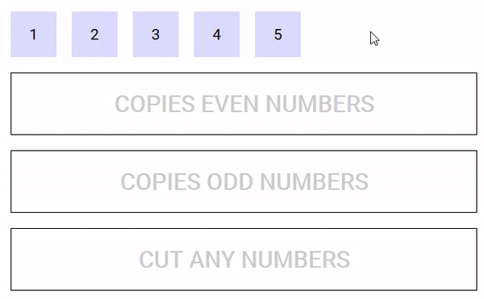
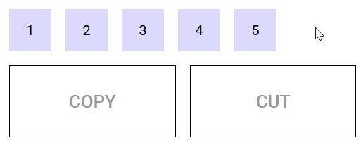
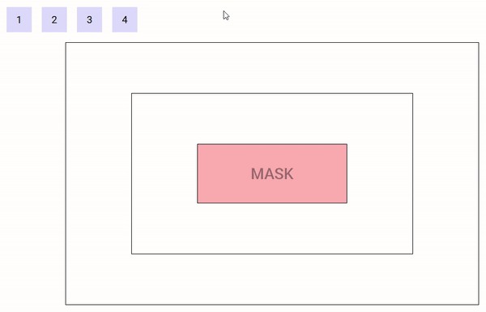
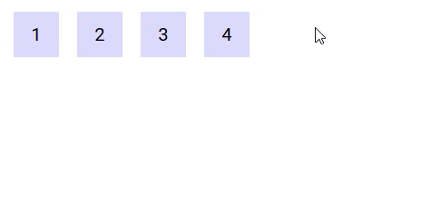

Easy-DND is a drag and drop implementation for Vue.js 2 that uses only standard mouse events instead of the HTML5 drag and drop API, which is [impossible to work with](https://www.quirksmode.org/blog/archives/2009/09/the_html5_drag.html). Think of it as a way to transfer data from some components to others using the mouse or support for a mouse assisted copy/cut - paste.

# Demo

The following demo defines five Drag components that can be dragged into three Drop components, one that accepts even numbers, one that accepts odd numbers and one that accepts any number but removes them once the drag is complete.

https://codesandbox.io/s/easy-dnd-demo-fo078

Notice the following :

* An image follows the mouse cursor during the drag (the content that is cloned to serve as a drag image is configurable and depends on what the mouse is on top of)
* The mouse cursor takes four different shapes depending on what the mouse is on top of
* Different CSS classes are applied to the drop area depending on whether :
  * it accepts the drop or not
  * the mouse is on top of it or not

# Manual

## Components

There are three components : Drag, Drop and DropMask. The Drag component is meant to define an area from which data can be exported. The Drop component is meant to define an area into which data can be imported. Drop components can be nested forming hierarchies of arbitrary depth. The DropMask component is meant to create an island insensitive to drag and drop on top of a Drop component.

The following demo illustrates the three components :

https://codesandbox.io/s/example-1-ngrlv

## Modes

A drag and drop can occur in several possible modes, depending on its effect on the origin of the drag :

* `copy` : if the source of the drag is unaffected by the drag operation,
* `cut` : if the source of the drag is to be removed when the drag operation completes.

The list is not exhaustive. You can use any string you like if you need support for a custom operation on the drag source when the operation completes.

Drop components must declare what mode must be triggered when data is dropped into them using the `mode` property.

Drag components must signify what mode they accept by declaring listeners. For example, if a `@cut="..."` listener is declared on a Drag component, then it means it supports the `cut` mode. That listener will be called if a drag operation completes on a Drop component that declares the `cut` mode. The `copy` mode is an exception, any Drag component accepts it even if no `@copy="..."` listener is declared (although you can declare one).

The following demo illustrates the two modes in action :

https://codesandbox.io/s/example-2-r8n1k

## Type

A drag operation may have a type. The type is a data structure (can be a simple string) that defines the kind of data being transfered. The type of a drag operation is defined by the Drag component that initiates it.

A Drop component is said to participate in a drag operation if it accepts its type (the default is to accept any type). As far as Easy-DND is concerned, if a Drop component doesn't accept the type of the current drag operation, it behaves like any other part of the page that is not sensitive to drag and drop. It is ignored during the drag, no special CSS classes are applied, no special cursors / drag images are displayed and no special events are triggered.

The following demo illustrates the use of types :

https://codesandbox.io/s/example-3-g7io8

In this demo there are two types in use : 'string' and 'number'. The Drag components that contain '1' and '2' are of type 'number', the ones containing 'a' and 'b' are of type 'string'. The two Drop components on the left accept numbers, the ones on the right accept strings. When you drag a number/string (respectively), only Drop components that accept numbers/strings (respectively) react (i.e. drag images, CSS classes, cursors are applied). The other ones are left alone.

## Mouse cursor

If a drag isn't in progress, the cursor turns into `grab` when the mouse is over a Drag component. If a drag is in progress, the cursor turns into `grabbing`, unless it is over a Drop component that accepts the type of the current drag operation. Then, it turns into `pointer` if the Drop component accepts the data being dragged, and into `not-allowed` otherwise.

## Drag image

During the drag, an image may move along the mouse cursor. Easy-DND makes it so that this image is always on top of everything else. The Drag component provides a slot that can be used to set the default image displayed during the drag operation :

* if the slot isn't defined, the image is a clone of the Drag component.
* if the slot is defined and empty, there is no image.
* if the slot is not empty, a clone of its content is used.

The Drop component provides a slot that can be used to set the image to be displayed when the mouse is over it, if the Drop component participates in the current drag operation (i.e. it accepts its type) :

* if the slot isn't defined, the default image set by the Drag component is used.
* if the slot is defined and empty, there is no image.
* if the slot is not empty, a clone of its content is used.

The position of the drag image relative to the mouse cursor can be controlled by CSS using the transform property.

The following demo illustrate the use of custom drag images, nested Drop components and a mask :

https://codesandbox.io/s/example-4-6h8zy

## CSS classes

A Drag component is assigned the class `drag-in` when the mouse is over it (or if a drag is in progress and the operation originates from it), `drag-out` otherwise.

During a drag operation, the Drop components on the page are assigned several CSS classes :

* for all Drop components : `type-allowed` if the Drop component accepts the type of the drag operation, `type-forbidden` otherwise
* for the Drop components that participate in the drag operation (i.e. accept its type) :
  * `drop-in` when the mouse is over one that is foremost at the current mouse position (remember Drop components can be nested), `drop-out` otherwise
  * `drop-allowed` when the Drop component accepts the data and the source of the drag accepts its mode, `drop-forbidden` otherwise

## DragSensitive mixin

A mixin is available to make components sensitive to drag operations. It adds the following computed fields to components that incorporate it :

* dragInProgress : true if a drag operation is in progress, false otherwise
* dragType : the type of the current drag operation
* dragData : the data of the current drag operation

The following demo displays information about the current drag operation when it is in progress :

https://codesandbox.io/s/example-5-j8qo9

# API

## Events

Every event described in the following sections emits a data structure with the following fields :

* `type` : the type of the current drag operation
* `data` : the data of the current drag operation
* `mouse` : the native mouse event that triggered this custom event

## Drag

### Props

* `tag` : element used as root for the template of the Drag component
  * default value : div
  * type : String (for html tags) or Object (for Vue components)
* `type` : type of the data being dragged when the drag operation originates from this component
  * default value : null
  * type : any
* `data` : data being dragged when the drag operation originates from this component
  * default value : null
  * type : any

### Slots

* `drag-image` : content to be cloned and used as a drag image displayed along the mouse cursor during the drag

### Events

* `dragstart` : emitted when the drag starts, first event of all
* `dragend` : emitted when the drag ends, last event of all
* `cut` or `copy` (or any custom mode) depending on the mode of the Drop component that terminated the drag operation

## Drop

### Props

* `tag` : element used as root for the template of the Drag component
  * default value : div
  * type : String (for html tags) or Object (for Vue components)
* `accepts-type` : defines the type(s) that the Drop component accepts as import data
  * default value : () => true (i.e. accepts any type)
  * type : string, string[] or {(type) : boolean}
* `accepts-data` : defines the data that the Drop component accepts as import data
  * default value : () => true (i.e. accepts any data)
  * type : {(data, type) : boolean}
* `cursor` : the mouse cursor to use when the mouse is above the Drop component and the drop is allowed
  * default value : `pointer`
  * type : 
* `mode` : the mode of the Drop component
  * default value : `copy`
  * type : string

### Slots

* `drag-image` : content to be cloned and used as a drag image displayed along the mouse cursor during the drag when the mouse cursor is above the Drop component

### Events

* `dragenter` : emitted during a drag operation when the mouse cursor enters a Drop component
* `dragleave` : emitted during a drag operation when the mouse cursor leaves a Drop component
* `dragover` : emitted during a drag operation when the mouse cursor move over a Drop component
* `drop` : emitted when a drop operation completes in a Drop component

